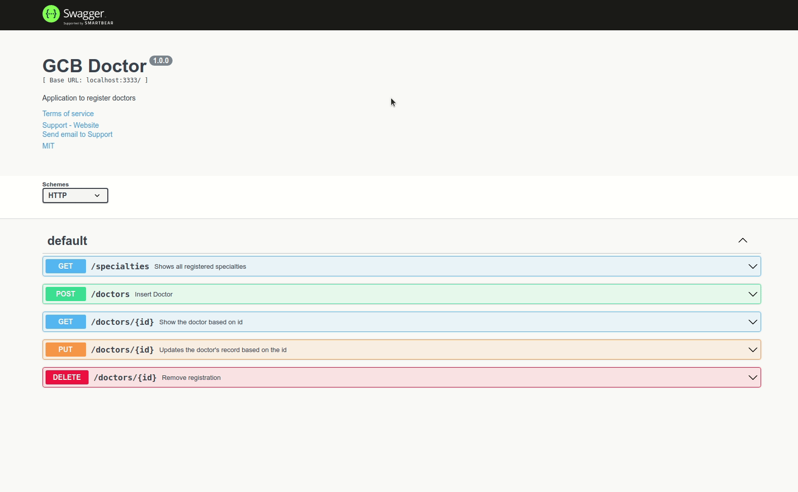

<h1 align="center">Desafio Backend - GCB</h1>
<p align="center">Desafio proposto para vaga de backend da empresa GCB Investimentos.</p>
</br></br>

### Documentação em formato Swagger:
http://localhost:3333/swagger/


### Pré-Requisitos

Antes de começar você deve ter instalado em sua máquina o [Docker-compose](https://docs.docker.com/compose/install/) para buidar as imagens necessárias para rodar a aplicação.
</br>

### 🎲 Como começar?

```bash
# Clone o repositório e acesse a pasta pelo terminal
$ git clone https://github.com/igoraraujocruz/gcbDoctor.git
$ cd gcbDoctor

# Crie um arquivo .env na raiz do projeto, copie todo o conteúdo do arquivo .env.exemple e cole no .env para "setarmos" as variáveis de ambiente, ou insira as variáveis que preferir.

# Com o Docker-compose instalado, execute o seguinte comando para buildas as imagens.
$ make start #caso esteja no linux: sudo make start

# Aguarde todo o processo finalizar. Logo depois, o server automaticamente irá inicializar e já será possível acessar a documentação swagger.
http://localhost:3333/swagger/

# Para as requisições POST será necessário conhecer o ID que foi automaticamente gerado da tabela de especialidades. Para isso clique na aba /specialties, try it out e execute. Após executar descobriremos os ID's. Vou deixar um gif abaixo, caso seja necessário.

# Agora é só testar a aplicação, caso tenha alguma dúvida, fique a vontade para perguntar, meus contatos estão logo a baixo.

```


</br>

## Author
---

<a href="https://github.com/igoraraujocruz/">
 
 <br />
 <sub><b>Igor Araujo Cruz</b></sub></a> <a href="https://www.linkedin.com/in/igor-araujo-cruz-84a89111b/" title="Linkedin"></a>


Done with a lot of dedication and passion by Igor Araujo Cruz 👋🏽
</br></br>
Contact

[](https://www.linkedin.com/in/igor-araujo-cruz-84a89111b/)
[](https://www.instagram.com/igoraraujocruzz/)
[](mailto:igoraraujocruzz@gmail.com)
